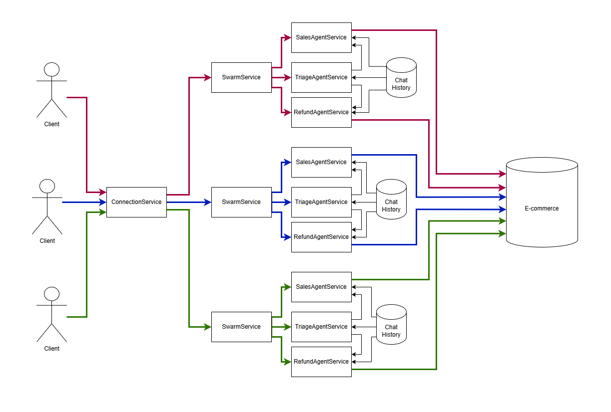
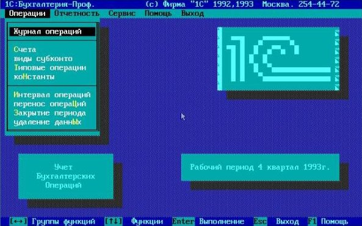
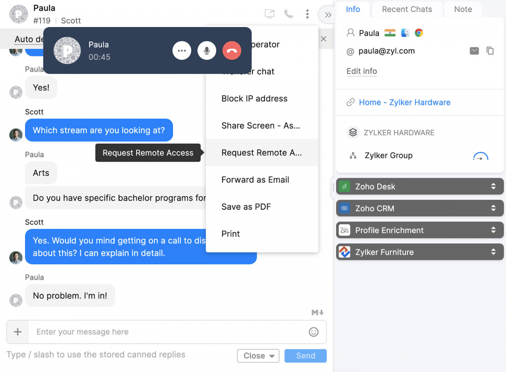
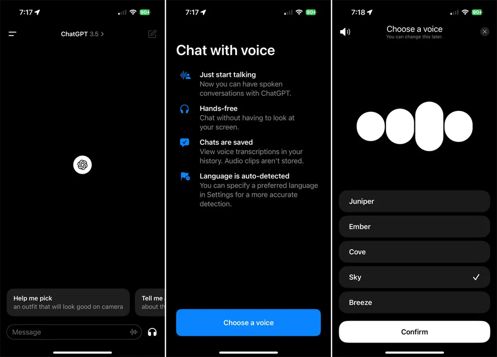

# 🐝 node-ollama-telegram-agent-swarm

> Multi-user Agent Swarm for Ollama



## Where the Market is Heading

Long ago, the graphical user interface replaced command-line input. It might seem that a pseudo-graphical interface could solve the interaction problem for unprepared users, but there's a factor that not everyone notices.

### Pseudo-graphical Interface



**Important!** Developing a graphical user interface is cheaper than a pseudo-graphical one. Historically, right after the Next CUBE release, ObjC was introduced with a graphical form editor where pages could be arranged with a mouse. In the modern world, Frontend provides graphical form debugging through Dev Tools, which is essentially the same thing: nominal code without technical details, and when problems arise, there's a GUI that makes bug finding cheaper.

### Graphical Interface



But it's even cheaper not to make a user interface at all. You don't need a static IP, PCI DSS, a domain promoted in Yandex and Google, or highload if you decide not to reinvent the wheel and create yet another web product that will cost three times more to attract visitors than to develop.

### Voice Interface



Telephone comes from the word "phone," phonetics - sound. Instead of learning a huge number of button combinations for Figma, Blender, Photoshop, Unreal Engine, it's simpler to just voice the command. How do you rotate a drawing in ArchiCAD?

### LLM as a New Type of User Interface

Agent Swarm is like fragments in Android or a router in React: they allow you to specify the scope of tasks (buttons on screen) based on previous user input. For example, when a call comes in on a SIP phone, you first need to understand if the person wants to buy or return an item in principle, and then offer them a list of available products.

## Technical Requirements

The tax office will always ask for debit/credit in tabular form, so CRM systems won't go anywhere. The task of LLM is to parse natural text from either chat or voice recognition and transform it into a function signature with name and arguments so that it can be called and data can be written to the database.

To solve this problem, it's important to know several nuances:

- As of 2025, OpenSource language models for offline launch hallucinate in 40-50% of cases, while the original ChatGPT does so in 5-10% of cases.
- If you don't divide the prompt into agents, the model will hallucinate more as the subject of conversation becomes vague.
- Every month, new models appear that hallucinate less. Alternative SaaS solutions appear whose code is closed but are cheaper than ChatGPT, for example, DeepSeek.

### As a Consequence

- Chatbot code should be independent of the LLM provider with the ability to switch between GPT4All, Ollama, OpenAI, DeepSeek, etc., without editing business logic.
- There should be a testbed that allows evaluation of how many prompts broke when changing the language model or provider, as versioning due to SJW censorship is not provided: prompt behavior changes quietly without publicizing details.
- Code for orchestrating chat sessions with active agent context should be separated from the LLM provider or framework, as something new could come out at any moment.

## Code Analysis

For each open chat session, Swarm orchestration needs to be performed with a tree of agents having a shared chat history between them and separate for different users. In this code, it's implemented under the hood of agent-swarm-kit.

```tsx
import { addSwarm } from "agent-swarm-kit";

export const ROOT_SWARM = addSwarm({
    swarmName: 'root_swarm',
    agentList: [
        TRIAGE_AGENT,
        SALES_AGENT,
    ],
    defaultAgent: TRIAGE_AGENT,
});

...

app.get("/api/v1/session/:clientId", upgradeWebSocket((ctx) => {
  const clientId = ctx.req.param("clientId");

  const { complete, dispose } = session(clientId, ROOT_SWARM)

  return {
    onMessage: async (event, ws) => {
      const message = event.data.toString();
      ws.send(await complete(message));
    },
    onClose: async () => {
      await dispose();
    },
  }
}));
```

When creating an agent, we specify at least one system message describing what it should do. We specify the connector to the language model, which will allow some agents to be processed locally for free, while delegating complex ones to the OpenAI cloud service. If something doesn't work, we add prompts to the system array, for example, function call fixes for Ollama.

```tsx
const AGENT_PROMPT = `You are a sales agent that handles all actions related to placing the order to purchase an item.
Tell the users all details about products in the database by using necessary tool calls
Do not send any JSON to the user. Format it as plain text. Do not share any internal details like ids, format text human readable
If the previous user messages contains product request, tell him details immidiately
It is important not to call tools recursive. Execute the search once
`;

/**
 * @see https://github.com/ollama/ollama/blob/86a622cbdc69e9fd501764ff7565e977fc98f00a/server/model.go#L158
 */
const TOOL_PROTOCOL_PROMPT = `For each function call, return a json object with function name and arguments within <tool_call></tool_call> XML tags:
<tool_call>
{"name": <function-name>, "arguments": <args-json-object>}
</tool_call>
`;


export const SALES_AGENT = addAgent({
  agentName: "sales_agent",
  completion: OLLAMA_COMPLETION,
  system: [TOOL_PROTOCOL_PROMPT],
  prompt: AGENT_PROMPT,
  tools: [SEARCH_PHARMA_PRODUCT, NAVIGATE_TO_TRIAGE],
});
```

In this example, I use Ollama to process user requests. For those unfamiliar with the terminology: the process where a language model receives chat history with a user as input and outputs a new message is called completion. Agent-swarm-kit uses an abstract interface that works similarly with any cloud provider or local model. Use [this article to connect DeepSeek](https://api-docs.deepseek.com/guides/function_calling).

```tsx
import { addCompletion, IModelMessage } from "agent-swarm-kit";

const getOllama = singleshot(() => new Ollama({ host: CC_OLLAMA_HOST }));

export const OLLAMA_COMPLETION = addCompletion({
  completionName: "ollama_completion",
  getCompletion: async ({
    agentName,
    messages,
    mode,
    tools,
  }) => {
    const response = await getOllama().chat({
      model:  "nemotron-mini:4b", // "mistral-nemo:12b";
      keep_alive: "1h",
      messages: messages.map((message) => omit(message, "agentName", "mode")),
      tools,
    });
    return {
      ...response.message,
      mode,
      agentName,
      role: response.message.role as IModelMessage["role"],
    };
  },
});
```

Changing the active agent and getting data from the database is done through tool calls: the language model returns special XML that is processed by the framework for local models or by the cloud provider for OpenAI to call external code in Python/JS, etc. The execution result is recorded in the chat history as `{"role": "tool", "content": "Product Paracetamol found in database: fever reducer for fighting flu"}`. From the next user message, the language model operates with data from the tool.

```tsx
import { addTool, changeAgent, execute } from "agent-swarm-kit";

const PARAMETER_SCHEMA = z.object({}).strict();

export const NAVIGATE_TO_SALES = addTool({
  toolName: "navigate_to_sales_tool",
  validate: async (clientId, agentName, params) => {
    const { success } = await PARAMETER_SCHEMA.spa(params);
    return success;
  },
  call: async (clientId, agentName) => {
    await commitToolOutput(
      "Navigation success`,
      clientId,
      agentName
    );
    await changeAgent(SALES_AGENT, clientId);
    await execute("Say hello to the user", clientId, SALES_AGENT);
  },
  type: "function",
  function: {
    name: "navigate_to_sales_tool",
    description: "Navigate to sales agent",
    parameters: {
      type: "object",
      properties: {},
      required: [],
    },
  },
});
```

To avoid hardcoding initial agent messages, when switching agents, a user request simulation occurs asking to say hello.

```tsx
import {
  addTool,
  commitSystemMessage,
  commitToolOutput,
  execute,
  getLastUserMessage,
} from "agent-swarm-kit";

const PARAMETER_SCHEMA = z
  .object({
    description: z
      .string()
      .min(1, "Fulltext is required")
  })
  .strict();


export const SEARCH_PHARMA_PRODUCT = addTool({
  toolName: "search_pharma_product",
  validate: async (clientId, agentName, params) => {
    const { success } = await PARAMETER_SCHEMA.spa(params);
    return success;
  },
  call: async (clientId, agentName, params) => {
    let search = "";
    if (params.description) {
      search = String(params.description);
    } else {
      search = await getLastUserMessage(clientId);
    }
    if (!search) {
      await commitToolOutput(
        str.newline(`The products does not found in the database`),
        clientId,
        agentName
      );
      await execute(
        "Tell user to specify search criteria for the pharma product",
        clientId,
        agentName
      );
      return;
    }
    const products = await ioc.productDbPublicService.findByFulltext(
      search,
      clientId
    );
    if (products.length) {
      await commitToolOutput(
        str.newline(
          `The next pharma product found in database: ${products.map(
            serializeProduct
          )}`
        ),
        clientId,
        agentName
      );
      await commitSystemMessage(
        "Do not call the search_pharma_product next time!",
        clientId,
        agentName
      );
      await execute(
        "Tell user the products found in the database.",
        clientId,
        agentName
      );
      return;
    }
    await commitToolOutput(
      `The products does not found in the database`,
      clientId,
      agentName
    );
    await execute(
      "Tell user to specify search criteria for the pharma product",
      clientId,
      agentName
    );
  },
  type: "function",
  function: {
    name: "search_pharma_product",
    description:
      "Retrieve several pharma products from the database based on description",
    parameters: {
      type: "object",
      properties: {
        description: {
          type: "string",
          description:
            "REQUIRED! Minimum one word. The product description. Must include several sentences with description and keywords to find a product",
        },
      },
      required: ["description"],
    },
  },
});
```

Language models can form a dictionary of named parameters for tool calls. However, OpenSource models handle this poorly if there's a technical requirement for a closed circuit; it's simpler to analyze the conversation itself.

## How the Agent Swarm Works

Multiple ChatGPT sessions (agents) make tool calls. Each agent can use different models, for example, Mistral 7B for everyday communication, Nemoton for business conversations.

The agent swarm directs messages to the active ChatGPT session (agent) for each WebSocket channel using the clientId URL parameter. For each new chat with a person, a new channel is created with its own swarm of agents.

The active ChatGPT session (agent) in the swarm can be changed by executing a tool.

All client sessions use a shared chat message history for all agents. Each client's chat history stores the last 25 messages with rotation. Between ChatGPT sessions (agents), only assistant and user type messages are transmitted, while system and tool messages are limited to the agent's scope, so each agent knows only the tools that relate to it. As a result, each ChatGPT session (agent) has its unique system prompt.

If an agent's output fails validation (non-existent tool call, tool call with incorrect arguments, empty output, XML tags in output, or JSON in output), the rescue algorithm will try to fix the model. First, it will hide previous messages from the model; if that doesn't help, it will return a placeholder like "Sorry, I didn't understand. Could you please repeat?"

## Useful Functions for Agent Swarm Administration

- `addAgent` - Register a new agent
- `addCompletion` - Register a new language model: cloud, local, or mock
- `addSwarm` - Register a group of agents for processing user chats
- `addTool` - Register a tool for integrating language models into external systems
- `changeAgent` - Change active agent in the swarm
- `complete` - Request a response to a message passed to the agent swarm
- `session` - Create a chat session, provide callbacks for session completion and new message sending
- `getRawHistory` - Get raw system history for debugging
- `getAgentHistory` - Get history visible to the agent adjusted for self-recovery mechanism and message recipients
- `commitToolOutput` - Send function execution result to history. If a function was called, the agent freezes until receiving a response
- `commitSystemMessage` - Supplement system prompt with new inputs
- `commitFlush` - Clear conversation for agent if incorrect responses were received or the model erroneously calls a tool recursively
- `execute` - Ask the neural network to take initiative and write to the user first
- `emit` - Send a pre-prepared message to the user
- `getLastUserMessage` - Get the last message from the user (without considering execute)
- `commitUserMessage` - Save user message in chat history without response. If user spams messages without waiting for request processing
- `getAgentName` - Get active agent name
- `getUserHistory` - Get history of user messages
- `getAssistantHistory` - Get history of language model messages
- `getLastAssistantMessage` - Get last message from language model
- `getLastSystemMessage` - Get last system prompt supplement
